# Flutter Animated Widgets

Modern Flutter animation showcase with:
- Premium splash and gallery UI
- Basic animations section
- Advanced animations section
- Auto-looping animation examples

## Demo Videos

Add your recorded videos in `docs/videos/` so anyone visiting the repository can preview the app quickly.

Naming convention used below:
- `basic-*.mov` for source videos
- `advanced-*.mov` for source videos
- `docs/videos/gif/*.gif` for inline README previews

### Basic Animations

| Demo | Demo |
|---|---|
| **Fade Animation**<br>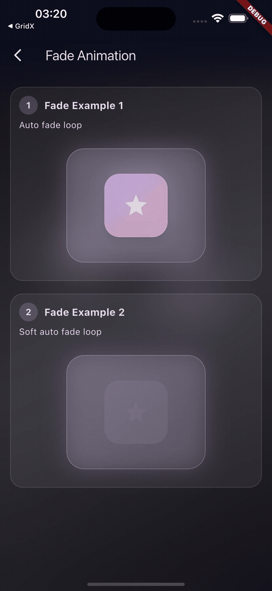<br>[Watch video](docs/videos/basic-fade.mov) | **Scale Animation**<br>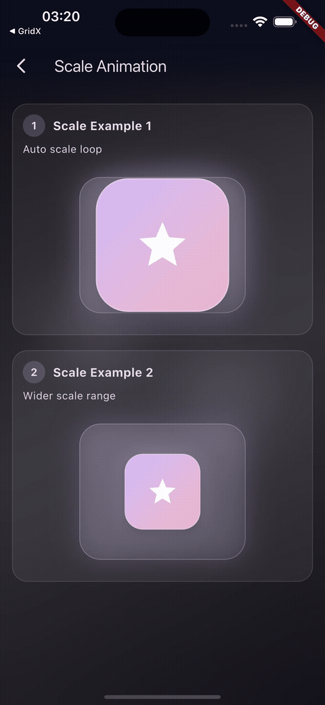<br>[Watch video](docs/videos/basic-scale.mov) |
| **Rotation Animation**<br>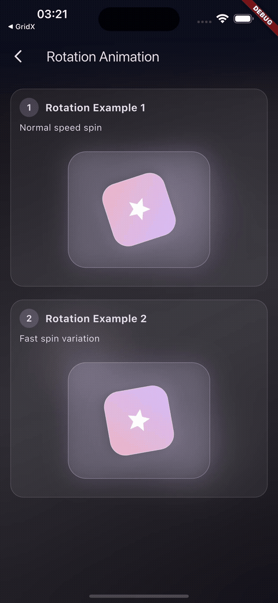<br>[Watch video](docs/videos/basic-rotation.mov) | **Slide Animation**<br>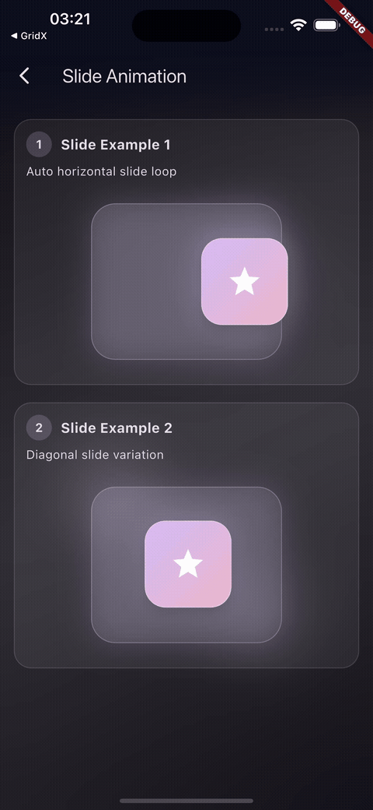<br>[Watch video](docs/videos/basic-slide.mov) |
| **Size Animation**<br>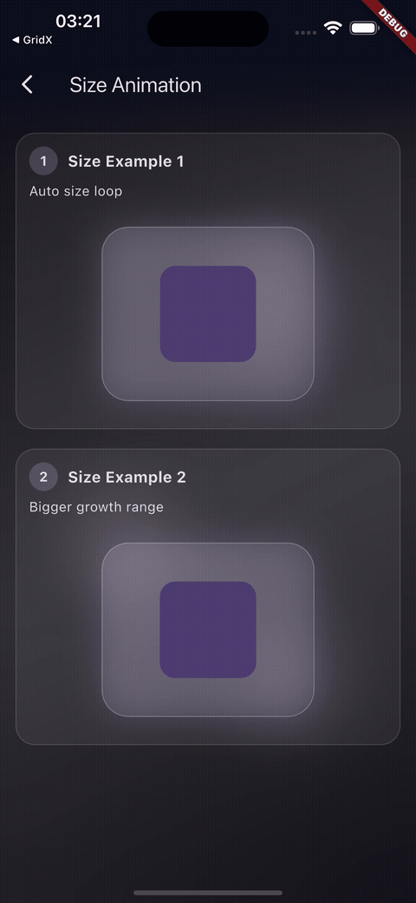<br>[Watch video](docs/videos/basic-size.mov) | **Color Animation**<br>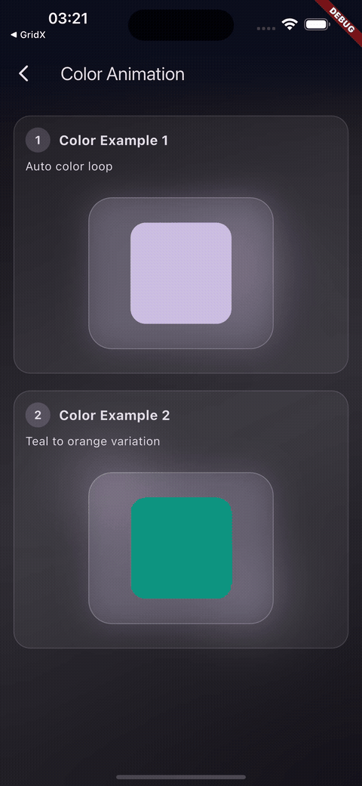<br>[Watch video](docs/videos/basic-color.mov) |
| **Hero Animation**<br>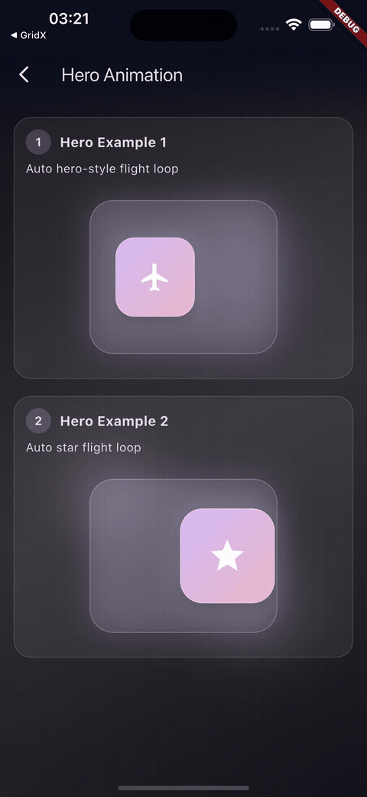<br>[Watch video](docs/videos/basic-hero.mov) | **Staggered Animation**<br>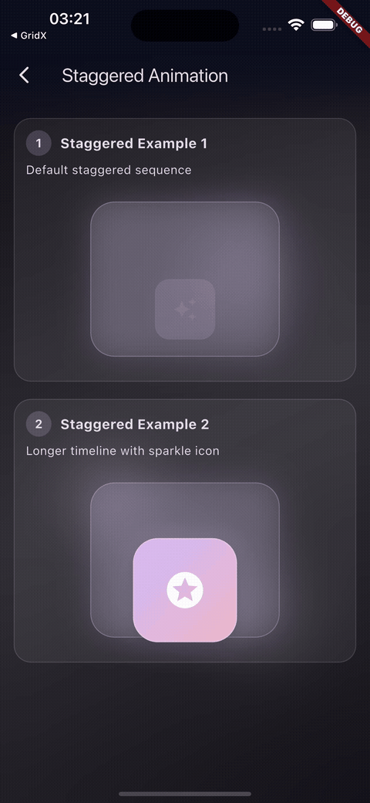<br>[Watch video](docs/videos/basic-staggered.mov) |

### Advanced Animations

| Demo | Demo |
|---|---|
| **Depth Motion**<br>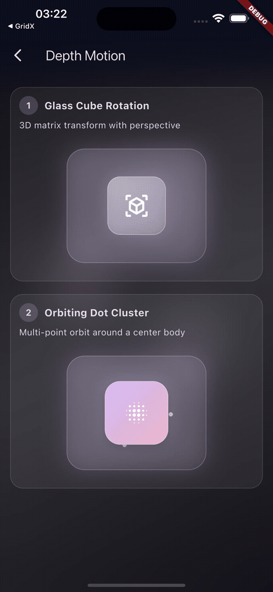<br>[Watch video](docs/videos/advanced-depth-motion.mov) | **Signal Waves**<br>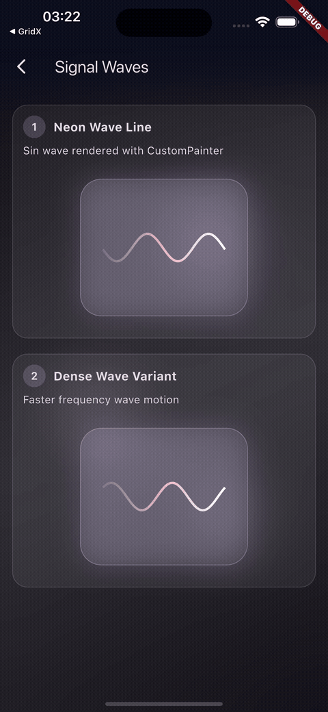<br>[Watch video](docs/videos/advanced-signal-waves.mov) |
| **Morphing Forms**<br>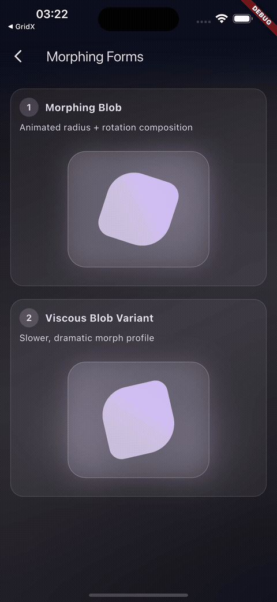<br>[Watch video](docs/videos/advanced-morphing-forms.mov) | **Particle Systems**<br>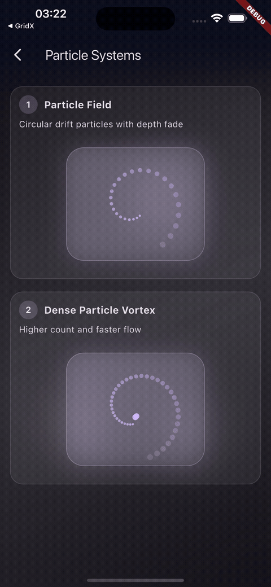<br>[Watch video](docs/videos/advanced-particle-systems.mov) |

## Run Locally

```bash
flutter pub get
flutter run
```

## Tech

- Flutter (Material 3)
- Custom animations with `AnimationController`, `Tween`, and `CustomPainter`
